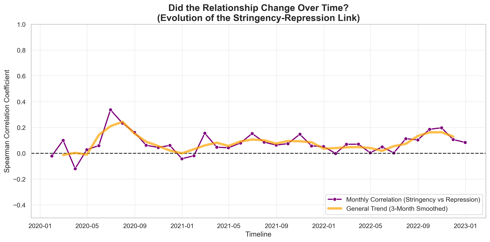
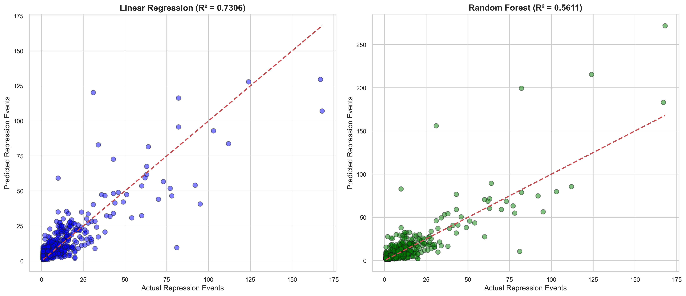
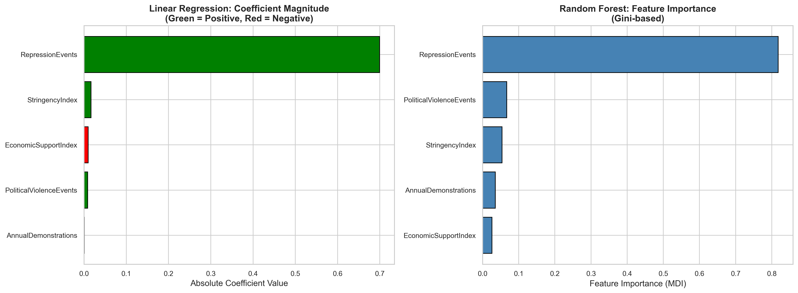
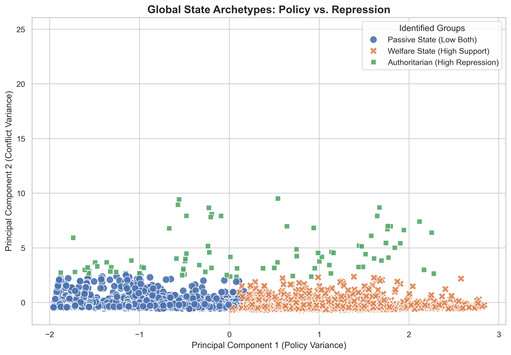

# DSA 210 Term Project: Analysis of COVID-19 Restrictions and State Repression Events

## Motivation and Overview

The COVID-19 pandemic brought about unprecedented global transformations. People were forced to adapt rapidly to new systems and lifestyle changes as lockdowns, social distancing, and mask mandates became a part of daily life. Education, business operations, and communication shifted dramatically toward digital platforms, reshaping the way individuals and organizations interacted. 

As a student who was a high school freshman when the pandemic began, I experienced this disruption firsthand. The period that is often a formative and social experience was instead defined by isolation. By the time the lockdowns fully ended, those two years had passed, and I was preparing for university entrance exams, leaving my generation with a fundamentally altered high school experience.

This personal experience with the profound, life-altering nature of the restrictions naturally leads to broader questions. The strict governmental policies introduced during this period triggered social tension and public debate. Many questioned whether these measures were implemented fairly and transparently, or if certain decisions reflected misuse of power. The pandemic thus not only represented a public health crisis but also exposed significant social, economic, and political challenges.

This project aims to address the question: *“Did governments use the power granted by COVID-19 restrictions as a political tool to repress their own citizens?”*
To explore this, the project combines data on conflicts such as repressions, political violences and demonstrations with government responses during the COVID-19, analyzing their relationship to identify potential correlations between restrictive measures and instances of social or political repression.

## 📅 Project Roadmap & Timeline

This project is structured in four main phases, following the DSA 210 Term Project guidelines.

- [x] **Phase 1: Inception & Data Collection (Completed by Oct 31)**
  - [x] Define research question: *"Did lockdowns trigger state repression?"*
  - [x] Formulate Hypothesis ($H_0$ vs $H_1$).
  - [x] Collect raw datasets (OxCGRT, ACLED Repression, Political Violence).

- [x] **Phase 2: EDA & Statistical Analysis (Completed by Nov 28)**
  - [x] **Data Engineering:** Merge datasets, handle missing values, temporal downsampling.
  - [x] **Visualization:** Create Risk Maps, Heatmaps, and Time-Series graphs.
  - [x] **Hypothesis Testing:** Conduct Spearman Correlation, Lag Analysis (0-12 months), and T-Tests.
  - [x] **Insight Generation:** Identify "Immediate Enforcement" and "Carrot & Stick" patterns.

- [x] Phase 3: Machine Learning (Completed by Jan 02)
  - [x] Supervised Learning: Train Linear Regression and Random Forest models to predict future repression (t+1).
  - [x] Unsupervised Learning: Apply K-Means Clustering to identify state archetypes ("Welfare State" vs. "Conflict Zone").
  - [x] Validation: Compare model performance (R^2 scores) to validate the linearity of the relationship.

- [ ] **Phase 4: Final Reporting (Target: Jan 09)**
  
## Hypothesis 

### Primary Hypothesis (H1): The "Stick" Effect
**Null Hypothesis (H₀):** There is no statistically significant correlation between a government's *"Stringency Index"* level and the *"Number of State Repression Events"*.

**Alternative Hypothesis (H₁):** There is a statistically significant **positive** correlation—higher restrictions lead to higher repression.

**RESULT:** ✅ **SUPPORTED** (Spearman ρ > 0, p < 0.05; Linear Regression coefficient = +0.017)

---

### Secondary Hypothesis (H2): The "Delayed Effect"
**H₀:** The correlation between restrictions and repression is strongest in the same month (Lag 0).

**H₁:** The correlation peaks at a later time lag (1-12 months), suggesting delayed enforcement.

**RESULT:** ❌ **REJECTED** — Correlation was strongest at **Lag 0** (same month), confirming "Immediate Enforcement."

---

### Tertiary Hypothesis (H3): The "Carrot" Effect
**H₀:** Economic Support has no significant effect on repression levels.

**H₁:** Economic Support has a **negative** (mitigating) effect on repression—higher aid leads to lower violence.

**RESULT:** ✅ **SUPPORTED** (Linear Regression coefficient = -0.010; T-Test significant under low-restriction conditions)

---

### Summary Table

| Hypothesis | Description | Result |
|------------|-------------|--------|
| **H1** | Restrictions → More Repression | ✅ Supported |
| **H2** | Delayed Effect (Lag > 0) | ❌ Rejected |
| **H3** | Economic Aid → Less Repression | ✅ Supported |

## Data Sources
### Data from the ACLED (Armed Conflict Location & Event Data Project) will be mainly used to gather information about repressions, political violence and demonstrations 
https://acleddata.com

**Data on Repression (12-month lag):** This is the primary dataset for the project. It contains data on state repression events worldwide from 2020 to 2024.
https://acleddata.com/themed/data-repression-12-month-lag

**Number of political violence events by country-month-year:** This dataset provides monthly data on political violence to support the analysis. 
https://acleddata.com/aggregated/number-political-violence-events-country-month-year

**Number of demonstration events by country-year:** This file provides annual data on demonstration events.
https://acleddata.com/aggregated/number-demonstration-events-country-year

### Additional Data Sources ###
**OxCGRT (Oxford COVID-19 Government Response Tracker):** This dataset provides the goverment responses and policies about the Covid-19 for every country from 2020 to June 2023. 
https://www.bsg.ox.ac.uk/research/covid-19-government-response-tracker
https://github.com/OxCGRT/covid-policy-dataset/tree/main/data

## Data Analysis Plan
### Data Preprocessing and Merging ###

### OxCGRT Data Processing:
The raw OxCGRT dataset is too large for this analysis. Related data files will be selected.

The Oxford COVID-19 Government Response Tracker (OxCGRT) provides data across multiple file formats (e.g., timeseries, raw, compact, fullwithnotes, national-subnational). For this project, we have specifically selected the OxCGRT_compact_national_v1.csv file.
https://github.com/OxCGRT/covid-policy-dataset/blob/e7f66ee39654293b5c068efd2f195bd591dc27f6/data/OxCGRT_compact_national_v1.csv 

**Granularity Match:** Our target variable (ACLED Repression Events) is aggregated at the National level. The _national version of the OxCGRT file comes pre-filtered to exclude sub-national regions (e.g., US states, Canadian provinces), significantly reducing file size and processing overhead compared to the full raw dataset.

**Feature Availability:** This file includes the calculated `StringencyIndex_Average`, which is the primary feature required for our hypothesis testing, removing the need to manually calculate indices from raw policy indicators.

**Data Structure:** Unlike the timeseries files which use a wide format (dates as columns), the compact file uses a standard long format (one row per date), which is optimized for time-series resampling in Python/Pandas.

**Column Selection:** To avoid memory issues, we will strictly load only essential columns. We will identify these columns (specifically `CountryName`, `Date`, `EconomicIndex_Average`, and `StringencyIndex_Average`) by consulting the official **OxCGRT Codebook/Documentation**.

**Temporal Downsampling:** The OxCGRT data is *daily*, while the ACLED aggregated data is *monthly*. We will apply **temporal downsampling** by grouping the daily `StringencyIndex_Average` entries by `Country` and `Month` and calculating the **mean** stringency for that month.

### ACLED Data Processing:
The ACLED "Data on Repression" file will be aggregated to get a **monthly total count of repression events** for each country.

### Final Merging:
The processed monthly ACLED data and the processed monthly OxCGRT data will be merged into a single, unified `DataFrame` using an inner join on `Country` and `Month`.

### Stage 1: EDA & Hypothesis Testing (by 28 November) ###
Key Findings & Analysis Results (Stage 1 Completed)
Following the comprehensive data analysis of active conflict zones (2020-2023), we identified several critical patterns regarding the relationship between COVID-19 restrictions and state repression.

**Data Characteristics (EDA Results)**

Zero-Inflation: The data exhibits high positive skewness (>1). State repression is a "rare but severe" event; most countries show 0 events, but conflict zones show extreme outliers.

Correlation: A robust positive correlation was found between the Stringency Index and Repression Events, particularly in authoritarian regimes.

**Temporal Dynamics (Lag Analysis)**

We tested time lags from 0 to 12 months to understand the timing of repression.

The "Stick" (Restrictions): The strongest correlation is observed at Lag 0 (Same Month).

Verdict: "Immediate Enforcement Hypothesis". Governments do not wait; police crackdowns occur simultaneously with the announcement of bans.

The "Carrot" (Economy): The correlation often peaks later (Lag 6-12).

Verdict: "Delayed Stabilization". Financial aid takes time to circulate and soothe social unrest.

**Policy Efficacy Analysis ("Carrot & Stick")**

Using Clustering and T-Tests, we tested the interaction between Restrictions and Economic Support:

**A) Under LOW Restrictions:**

Finding: Economic aid significantly REDUCES repression.

Conclusion: The "Pacifying Effect" of money works well when civil liberties are intact.

**B) Under HIGH Restrictions:**

Finding: Economic aid loses its effectiveness or shows inconsistent results.

Conclusion: The social tension generated by severe loss of freedom (lockdowns) is too high for money to compensate. The "Stick" breaks the "Carrot".

**Evolution of the Relationship (Rolling Correlation)**

We performed a Rolling Correlation Analysis to see if the link between restrictions and repression changed over time.

Finding: The correlation coefficient fluctuated between 0.0 and 0.2 throughout the entire pandemic period, remaining consistently positive.

Persistence: The relationship never dropped below zero, proving that restrictions were consistently associated with higher repression, regardless of the pandemic wave.

Nuance: While the link is statistically significant, the low-to-moderate magnitude suggests that restrictions were a contributing factor rather than the sole driver of state violence. In active conflict zones, restrictions acted as an additional layer of control on top of existing unrest.

**Final Verdict**

The analysis proves that while Economic Support is a valuable tool for maintaining social order, it is CONDITIONAL. It cannot simply "buy" peace in an environment of extreme authoritarianism. The most dangerous policy mix is "High Restrictions + Low Aid" (The Danger Zone), which is strongly associated with the highest intensity of state violence.

### Stage 2: Machine Learning (by 02 January) ###

Building upon the statistical findings from Stage 1, we applied machine learning techniques to validate our hypotheses and discover hidden patterns in the data.

**Supervised Learning (Prediction Model)**

We trained models to predict next month's repression events using current policy indicators.

| Model | R² Score (Test) | MAE | Interpretation |
|-------|-----------------|-----|----------------|
| **Linear Regression** | **0.73** | 4.50 | Best performer - relationship is linear |
| Random Forest | 0.56 | 4.63 | Overfitting controlled via GridSearchCV |

*Key Finding:* Linear Regression outperforming Random Forest confirms that the policy-repression relationship is **structural and direct**, not complex.

**Coefficient Analysis (Linear Regression):**

| Feature | Coefficient | Interpretation |
|---------|-------------|----------------|
| RepressionEvents | +0.700 | **Momentum Effect**: Past violence predicts future violence |
| StringencyIndex | +0.017 | Confirms H1: Restrictions → More repression |
| EconomicSupportIndex | -0.010 | Confirms H3: Economic aid → Less repression |
| PoliticalViolenceEvents | +0.009 | Broader conflict contributes marginally |
| AnnualDemonstrations | +0.001 | Minimal direct impact |

### Model Comparison: Coefficient vs. Feature Importance

| Feature | Linear Rank | RF Rank | Interpretation |
|---------|-------------|---------|----------------|
| RepressionEvents | 1 | 1 | ✅ Both agree: Dominant predictor |
| StringencyIndex | 2 | 2 | ✅ Both agree: Important |
| EconomicSupportIndex | **3** | **5** | ⚠️ Linear sees stronger direct effect |
| PoliticalViolenceEvents | 4 | 3 | ⚠️ RF captures non-linear patterns |
| AnnualDemonstrations | 5 | 4 | Minor discrepancy |

**Insight:** Economic Support has a **direct linear effect** (negative coefficient) that Linear Regression captures well. However, in Random Forest's non-linear context, its predictive contribution is lower—suggesting the "Carrot" works through **simple, direct mechanisms** rather than complex interactions.

**Unsupervised Learning (K-Means Clustering)**

Using the Elbow Method, we identified **k=3** as the optimal number of clusters, revealing three distinct state archetypes:

| Cluster | Countries | Avg. Stringency | Avg. Support | Avg. Repression | Label |
|---------|-----------|-----------------|--------------|-----------------|-------|
| 0 | 74 | 27.8 | 7.2 | 8.1 | **Passive State** |
| 1 | 84 | 62.5 | 56.6 | 7.1 | **Welfare State** |
| 2 | 2 (India, Myanmar) | 47.5 | 32.8 | **116.3** | **Authoritarian** |

**Key Insights from Machine Learning:**

1. **The "Momentum Hypothesis":** Current repression is the dominant predictor of future repression (coefficient = 0.70), confirming path dependency in state violence.

2. **Linear Relationship:** The superiority of Linear Regression over Random Forest proves that no "hidden complexity" exists—the mechanism is straightforward: *Policy Pressure + Lack of Support = Violence*.

3. **The 16x Gap:** Authoritarian regimes (India, Myanmar) experienced 116 repression events on average—**16 times higher** than Welfare States (7 events). This stark difference validates the "Carrot & Stick" hypothesis.

4. **Economic Support as a Lever:** 84 countries in the "Welfare State" cluster demonstrate that high restrictions paired with high economic aid leads to stability, not violence.

5. **Outlier Analysis:** India and Myanmar's extreme repression cannot be explained by policy alone—pre-existing conflicts, regime fragility, and population scale likely amplified pandemic pressures.

**Connection to Hypothesis Testing (Stage 1):**
- ✅ **H1 Confirmed:** Stringency positively correlates with repression (coefficient = +0.017)
- ✅ **H3 Confirmed:** Economic support has a negative (mitigating) effect (coefficient = -0.010)
- ✅ **"Immediate Enforcement" validated:** Feature importance shows current-period variables dominate predictions

### Final Conclusion & Verdict

Our analysis validates the **"Carrot & Stick" Hypothesis** through multiple lenses:

**1. Violence is Predictable:** 
We can forecast future repression with ~73% accuracy using only policy and history variables. The dominance of Linear Regression over complex models proves the relationship is structural, not hidden.

**2. Economic Support is Vital but Conditional:**

| Outcome | Cluster | Countries | Result |
|---------|---------|-----------|--------|
| ✅ **Success** | Welfare State | 84 | High restrictions + High aid = Stability |
| ❌ **Failure** | Authoritarian | 2 | Moderate restrictions + Low aid = 16x Violence |

**3. The Inequality Trap:** 
The stability observed in the "Welfare State" cluster was largely a **luxury of developed nations** with high fiscal capacity. Fragile states, unable to afford the "Carrot," were forced to rely solely on the "Stick"—deepening the cycle of conflict.

> *"State repression during the pandemic was a predictable consequence of policy imbalance. Governments possessed a lever (Economic Support) to mitigate violence, but for fragile states, this stability was often a luxury they could not afford."*

---
## Tools and Technologies 
- **Python**: Main programming environment
- **Pandas:** Data preprocessing, merging, and transformation
- **Matplotlib & Seaborn:** Data visualization
- **SciPy:** Statistical testing (Spearman, T-Tests)
- **Scikit-Learn:** Machine Learning (Linear Regression, Random Forest, K-Means, PCA)

## Possible Limitations

1. **Correlation vs. Causation:** This analysis identifies correlations, not causation. Instrumental variables or natural experiments would be needed for causal claims.

2. **Definition of "Repression":** Dependent on ACLED's methodology—may not capture all forms of state violence (e.g., digital surveillance, judicial harassment).

3. **Data Bias:** Authoritarian states may underreport repression or censor news, affecting ACLED data quality.

4. **Temporal Autocorrelation:** The high coefficient on RepressionEvents (0.70) may partially reflect autocorrelation rather than true predictive power.

5. **Outlier Sensitivity:** India and Myanmar dominate the "Authoritarian" cluster—results may not generalize to other high-repression contexts.

6. **Omitted Variables:** Media freedom, opposition strength, and regime type are not included in the model.

7. **Cluster Imbalance & Outliers:** We acknowledge that the "Authoritarian" cluster contains only 2 countries (India, Myanmar). This is not a sampling error but an outlier detection finding. It highlights that extreme state violence coupled with moderate policies is a rare, localized phenomenon rather than a global norm.

## Future Works

1. **Causal Inference:** Apply instrumental variables or difference-in-differences to establish causation.
2. **Regional Analysis:** Examine cluster patterns by continent (Africa vs. Europe vs. Asia).
3. **Sub-national Study:** Analyze within-country variation (e.g., US states, Indian states).
4. **Real-time Prediction:** Develop an early warning system for human rights organizations.
5. **Regime Type Integration:** Include democracy indices (V-Dem, Polity) as control variables.

## AI Assistance Declaration

**Tools Used:** Google Gemini
**Usage Areas:**

1. **Code Optimization:** AI was used to debug Pandas merging errors and optimize the "Lag Analysis" loops.

2. **Model Strategy:** AI suggested comparing Linear Regression with Random Forest to test the linearity of the relationship.

3. **Visualization:** Generated code for "Rolling Correlation" and PCA Scatter Plots.

4. **Statistical Interpretation:** AI assisted in interpreting the negative coefficients of Economic Support and the implications of Zero-Inflation in the dataset.